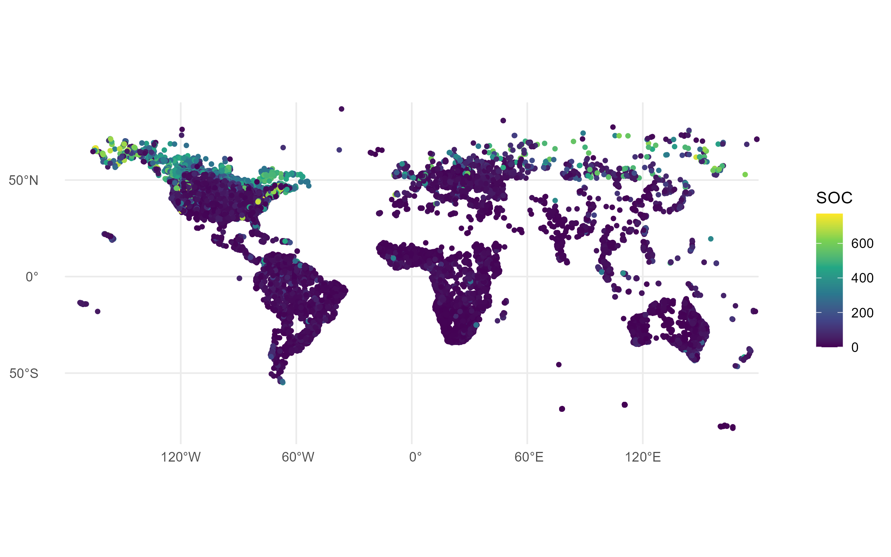

# 🌍 Soil Organic Carbon Mapping (Reproducible Project)

## 📌 项目简介

本项目基于 OpenLandMap SoilSamples 数据集，对全球土壤有机碳（SOC）进行空间可视化分析，并实现基础的数字土壤制图流程。

本项目重点体现：

* 数据处理
* 空间分析
* 可复现性

---

## 📂 数据来源

* 数据集：OpenLandMap SoilSamples https://github.com/openlandmap/SoilSamples.git
* 数据类型：全球土壤剖面化学属性数据
* 文件：`sol_chem.pnts_horizons.gpkg`

---

## ⚙️ 方法流程

### 1️⃣ 数据读取

使用 R 语言读取 `.gpkg` 空间数据：

```r
library(sf)
pts <- st_read("sol_chem.pnts_horizons.gpkg")
```

---

### 2️⃣ 数据预处理

* 提取表层土壤数据（第1层）
* 去除缺失值

```r
pts_top <- pts[!is.na(pts$organic_carbon_1), ]
```

---

### 3️⃣ 可视化分析

使用 `ggplot2` 绘制 SOC 空间分布：

```r
library(ggplot2)

ggplot(pts_top) +
  geom_sf(aes(color = organic_carbon_1)) +
  scale_color_viridis_c() +
  theme_minimal()
```

---

## 📊 结果展示



---

## 🔍 结果分析

从空间分布来看：

* 高 SOC 区域主要集中在高纬度地区（如北美、欧洲北部），可能与低温环境下有机质分解缓慢有关
* 低 SOC 区域主要分布在干旱或半干旱地区（如非洲、澳大利亚），有机质输入较少

整体呈现出明显的气候控制特征。

---

## 🔁 可复现性说明

### 环境要求

* R ≥ 4.0
* 必要包：

  * sf
  * ggplot2

### 复现步骤

1. 下载数据 `sol_chem.pnts_horizons.gpkg`
2. 运行 `analysis.R`
3. 自动生成 `SOC_map.png`

---

## 👥 小组成员

* 成员1：钟朝玥 2025303110078 @herb1124
* 成员2：邬丹 2025303120145 @wudan-06
* 成员3：宋家伟 2025303120089 @erwin214

---

## 📎 仓库说明

本仓库包含：

* `analysis.R`：完整代码
* `SOC_map.png`：结果图
* `README.md`：项目说明

---

## ✅ 结论

本研究成功实现了基于 SoilSamples 数据的 SOC 空间分布可视化，展示了数字土壤制图的基本流程，并保证了结果的可复现性。
